The first inofficial Eclipse Phase 2e system for Foundry is happy to announce it's bump to version 1.0 - just three years after I started to learn how to code (so we're both ready for Kindergarten now <3 ). The current system is in a state in which the core rules are working while I have also implemented some convenience features (e.g. automatic ammo count) where I see fit.

The time and energy I put into this project is happily given and does not demand any pay nor tribute. Though if you like my work and want to emotially support me, while going thorough all states of mental illness (described in the Eclipse Phase core rules) please consider:

Writing something nice

Buying me a kofi

## Most important features in overview

### Localization
- [Languages included](#languages-included)
- [About Localization](#about-localization)

### Features For Players
- [Character Sheet Design](#character-sheet-design)
- [Action Side Car Breakdown](#action-side-car-breakdown)
- [Contextual Dice Roll Menus](#contextual-dice-roll-menus)
- [Rules & Tooltips](#rules--tooltips)
- [Automatic Rest Calculator](#automatic-rest-calculator)

### Features For GMs
- [NPC & Threat Sheet Design](#npc--threat-sheet-design)
- [Enriched Dice Results](#enriched-dice-results)
- [Extensive Compendium Packs](#extensive-compendium-packs)
- [Automated Chat Feedback](#automated-chat-feedback)
- [Active Effects](#active-effects)

### Disclaimers
- [Personal](#personal)
- [Contribution](#contribution)
- [Legal](#legal)

## Localization

### Languages Included
To date we're supporting the system in the following languages:

1. English
2. Chinese (Simplified)
3. German
4. Portugese (BR)

Keeping this system up to date in all of these laguages is a never ending process. Therefore every laguage but English (which the system is written in) and German (which I'm a native speaker in) will show some not correctly localized parts here and there.

If you are a native speaker in any of these (or other) languages and want to support the system with your skills, feel free to contact me directly via mail or on discord (laphaela). You don't need any development skills and your help will be much appreciated by anyone who plays the system in your language!

### About Localization
We're happy to announce that from this moment on forward, the system at hand is fully localized and can and will be translated into as many laguages as possible. Please keep in mind, that the system is made for fans by fans. None of us gets paid for writing code, designing the sheets, improving the overall UX/UI or translating it into another language. Apart from the fact, that this means, that there might be errors and some sentences, words or speech patterns that are not as professional and clear as you might wish for, it also means, that none of this happens without YOU. Yes, we need YOU to make localization happen. So if you happen to speak & write any laguage not localized yet or are under the impression that you can support us or one of our language experts who created a localization for a specific language, feel free to reach out via discord. I'm happy to help you getting started or connect you to the people necessary to discuss your ideas of how to make our system more accessible for people speaking other languages than english.

## Features For Players

### Character Sheet Design
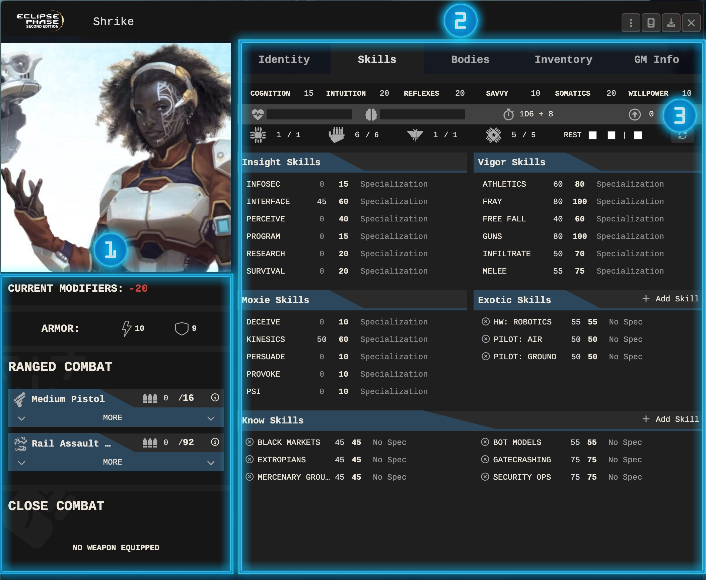
*The character sheet is designed to reduce player search time*

1. **The Action SideCar**
   Here you find an overview of the most important items your character has currently at hand. It's meant to be a combat/scene companion that gives you qick access to the items currently at hand. The Side Car also provides a lot of other helpful information.

   The basic idea of the Action Side Car is that you as a player sets up their characters inventory for a mission or scene and save navigation time afterwards, to prevent you from navigating to your (probably extensive) inventory again in search for this one item you want to use.

   Apart from this the Action Side Car comes with a number of convenience features that help you and your GM alike to understand the rules a bit better:
2. **The Main Section**
   A normal character has a lot of inventory to manage, such as armor, weapons, special gear and even vehicles or special abilities like psi sleights. While the skills tab is the most commonly used in this section, most of the other tabs are often just to help you setting your character up for a mission and then not to be seen again for some time. Yet it's still common to browse your different inventories while making up your mind how to overcome a threat.
   Holds every information that rarely changes during a session or even a campaign. It holds your aptitudes, traits & flaws and the personality description of your character as well as their goals, IDs and rep.
3. **The Health Bar**

### Action Side Car Breakdown

#### Modification Overview
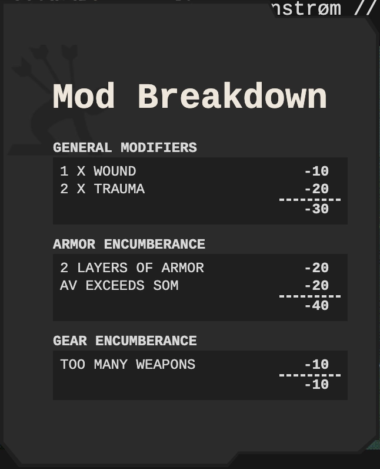

To provide you as a player with a better idea of the modifications automatically applied to your rolls, you have the Modification Over on top of the Side Car. You can always hover it to get more information about the nature of the modifications you're suffering.

 

#### Armor Section
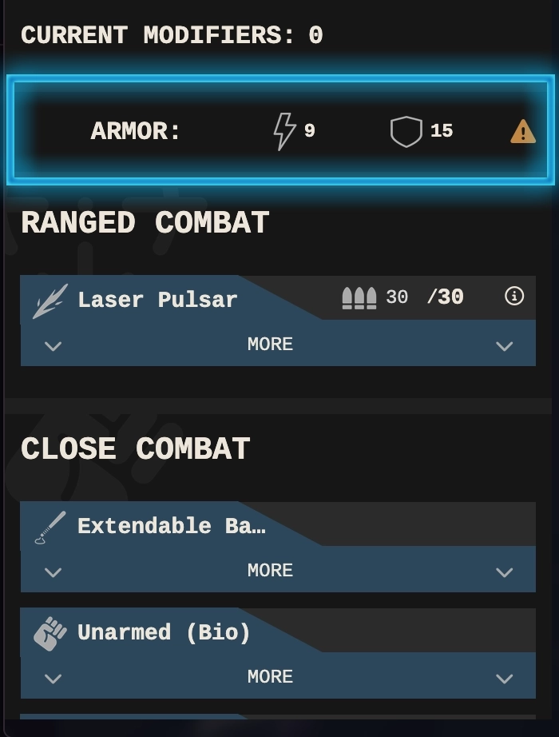

Presents the player with a cumulated value for both their energy and their kinetic armor. Beside stating if the armor exceeding certain thresholds it's also hoverable and players and GMs alike get a warning sign if any special modifiers apply.

 

#### Item Details
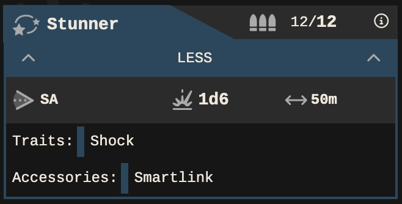

While it's necessary to reduce the provided information, about any item shown, to the bare minimum in order to save as much space as possible, players can easily decollapse these items to get to know more about their items at hand.

 

#### Reload Automation

Melee and Ranged weapons can be directly rolled from this section. If applicable, ranged weapons automatically deduct the ammo used from the sheet. The Action Side Bar provides players with the option to reload them directly. This mechanic is not yet bound to any ammunition. This will eventually change before deployment of v1.0.

### Contextual Dice Roll Menus
Most of the rules in Eclipse Phase a relatively straight forward, which is reflected in the minimal design of the common dice roll pop-up. To save you, as a player, time and nerves special rolls like attacks, fray or psi are enriched to provide the best UX as possible, while navigating through your GMs challenges.

|  |  |  |
|---|---|---|
| 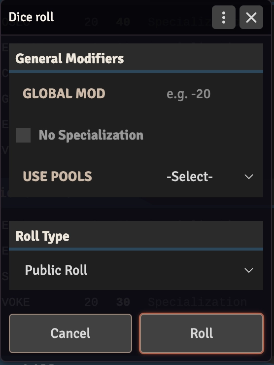 | 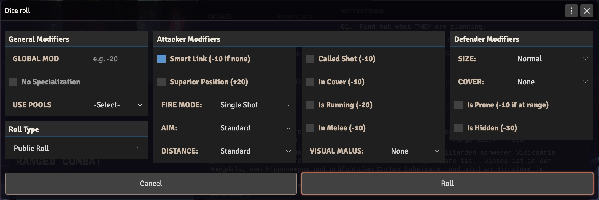 | 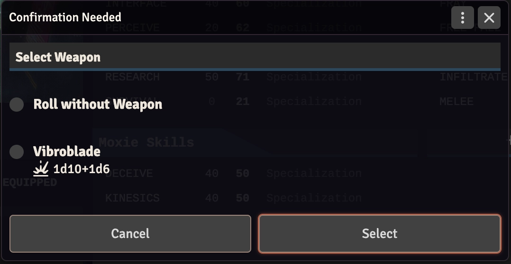 |

*Hacking is not yet a priority, but if you need it for your round, please let me know. This might heighten the possibility to implement it at some point.*

### Rules & Tooltips
Where applicable the system is enriched with other tooltips including some of the more complex rules of Eclipse Phase, to save you time searching for them in the rulebook. If you're missing some important rules feel free to open an issue and let's discuss this matter.

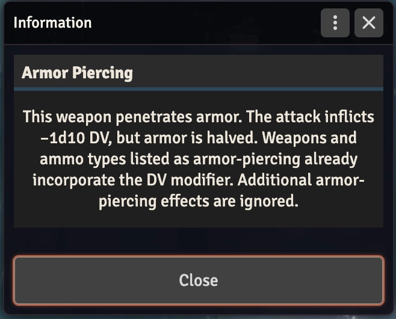

### Automatic Rest Calculator

Resting allows players to recover pool points. All you have to do is choosing your preferred rest type by clicking the checkbox next to it. The roll will happen automatically and refills your pools to the max if possible. If not it's presenting you with another menu to choose how to distribute your points.

|  |  |  |
|---|---|---|
| 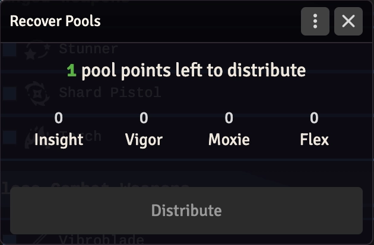 | 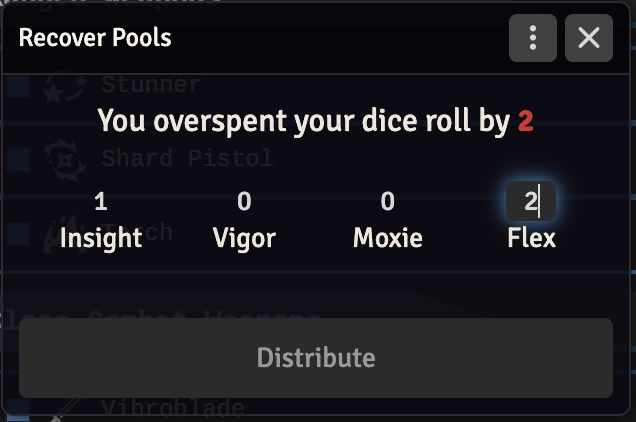 | 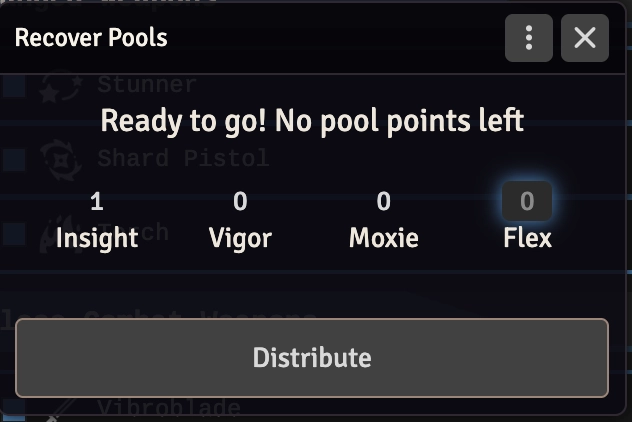 |

## Features For GMs

### NPC & Threat Sheet Design
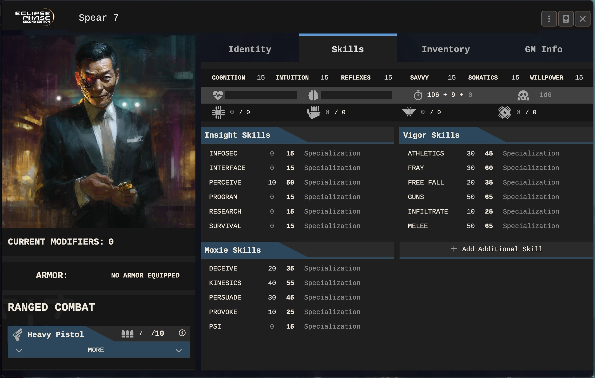

*The main difference between the Threat and the NPC sheet is the fact, that NPCs are provided with goals and extended psi rules, as they're meant to be closer to what a player character is about to experience during a mission or campaign.*

While player character sheets are quite complex, they're designed to be used in a more exclusive way, screen estate wise. While your players will commonly have only one character open, you might casually view multiple threat & NPC sheets all at once. Therefore the screens are reduced much more, without preventing you from using any other functionality.

### Enriched Dice Results
While the rules of EP are relatively straight forward, keeping track of all the modifiers affecting your players rolls can be tedious. This is why the system tries to make dice roll results as tranparent as possible.

|  |  |  |
|---|---|---|
| 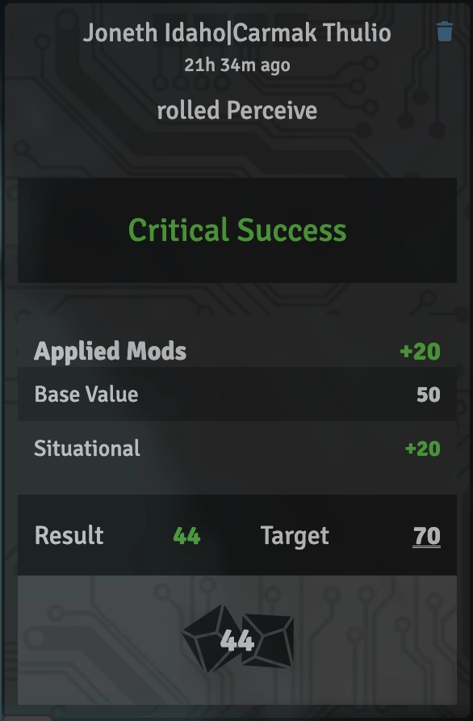 | 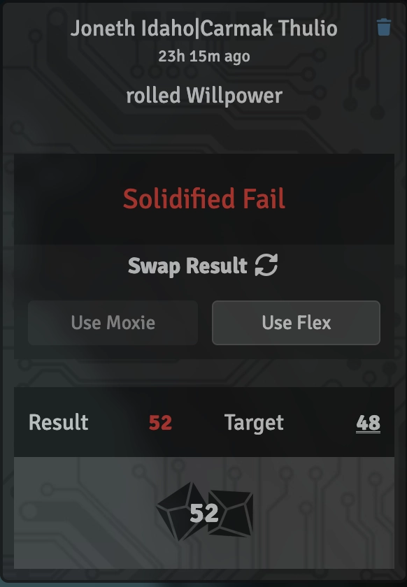 | 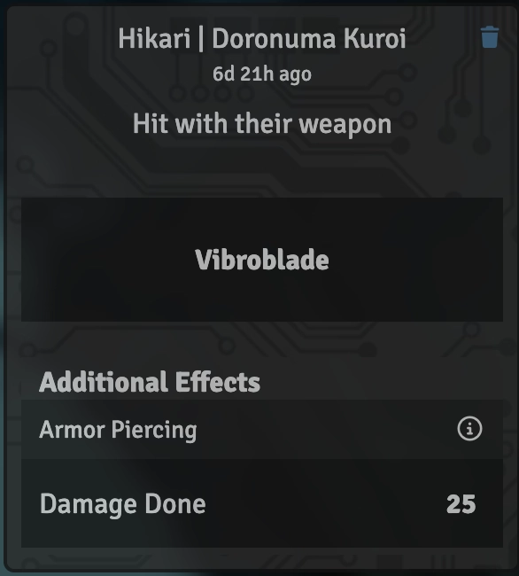 |

### Extensive Compendium Packs
Since Eclipse Phase is published under a creative commons license it's possible for us to provide you with many of the standard items, available from the EP2E base rules.

|  |  |  |
|---|---|---|
| 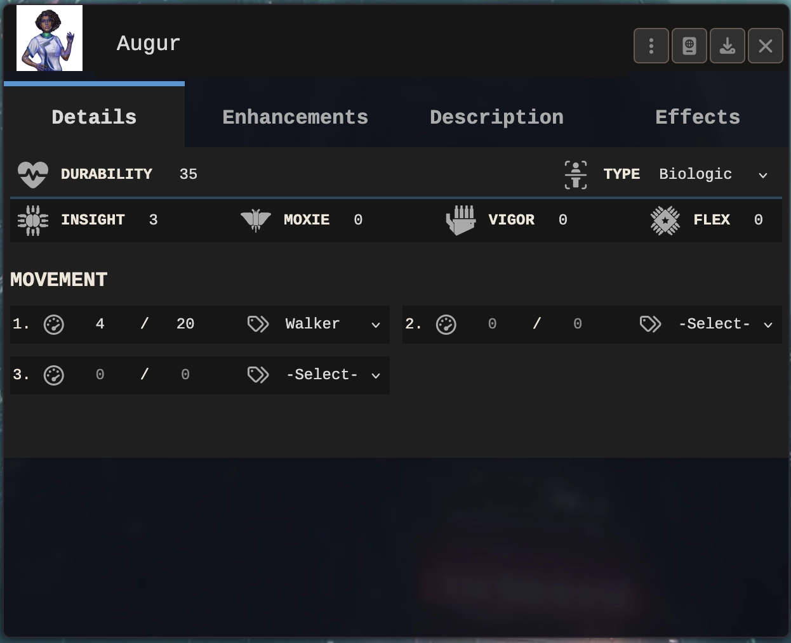 | 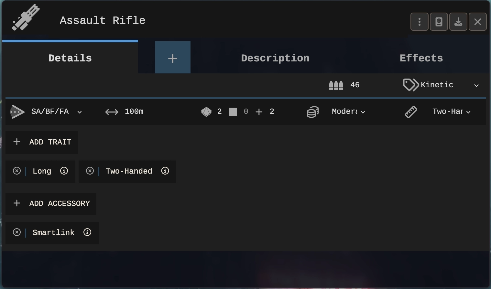 | 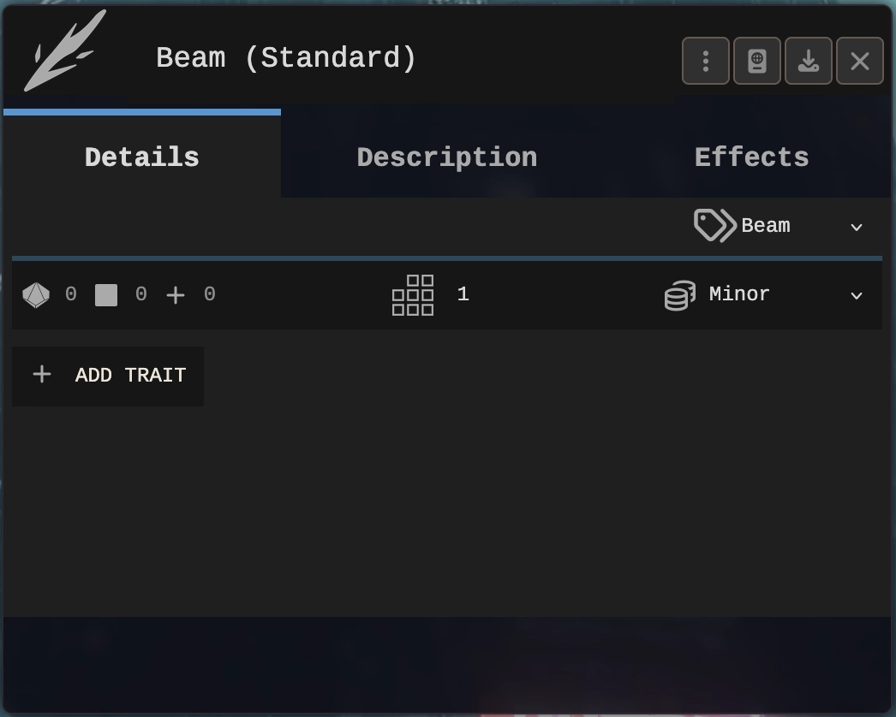 |

### Automated Chat Feedback
While TTRPG is all about trust and communication, there are sometimes things players forget to communicate while still important that you're keeping track of them. For this reason the system provides you with many automated chat messages, briefing you about what your players are about and how they're trying to achieve it.

|  |  |  |
|---|---|---|
| 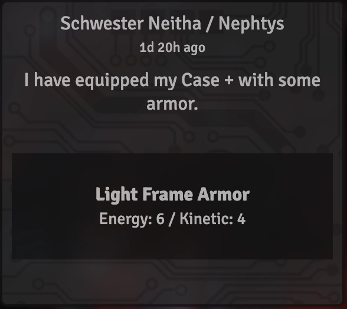 | 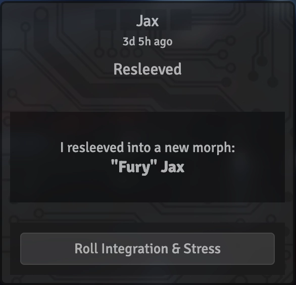 | 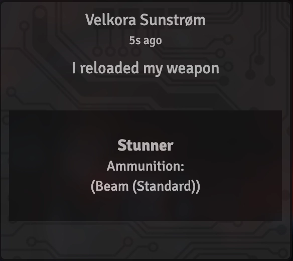 |

### Active Effects
Active Effects is a built in Foundry feature which works with this system. It helps players and game masters to add temporary effects which may be switched on and off based on several indicators like **presence of an item**, **real life time** or **the items status (active inactive)**.

Since there are several items (like traits, flaws and ware) that are morph specific we also included the automatic activation/deactivation of those items when the morph is switched, so you will never have to keep track of any situational modifiers you might only have during populating a specific morph. (**Important:** this only goes for any items which are **always** providing bonuses. Items that only provide bonuses in specific situations like "to all perceive tests **if smell is included**" do not work yet.)

Creating your own active effect items is simpel, but as for now you need to now the exact data value path. To make this a bit easier for you we created a list with all modifiers that are present till date, so you don't have to guess on how to build your own active effect items.

#### General Mods
- `system.mods.globalMod` = affects all skill/aptitude tests.
- `system.mods.traumaMod` = affects all skill/aptitude tests through trauma. (type "-10" to ignore one trauma)
- `system.mods.woundMod` = affects all skill/aptitude tests through trauma. (type "-10" to ignore one wound)
- `system.mods.woundMultiplier` = Sets a wound effect multiplier. This will not effect the number of wounds, but their effect (e.g. 1 wound -20 instead of -10)
- `system.mods.iniMod` = affects initiative. Will be added to the calculated ini + the dice roll.
- `system.mods.durmod` = affects durability. Will also be used to calculate derived stats.
- `system.mods.lucmod` = affects lucidity. Will also be used to calculate derived stats.
- `system.mods.ttMod` = affects trauma threshold. This gets added after the tt is calculated by the system.
- `system.mods.energyMod` = affects energy armor. This is added on top of the energy armor without any effect on encumberance.
- `system.mods.kineticMod` = affects kinetic armor. This is added on top of the kinetic armor without any effect on encumberance.

#### Pool Mods
- `system.pools.insight.mod` = affects the maximum insight pool.
- `system.pools.moxie.mod` = affects the maximum moxie pool.
- `system.pools.vigor.mod` = affects the maximum vigor pool.
- `system.pools.flex.mod` = affects the maximum flex pool.

#### Aptitude Mods
- `system.aptitudes.cog.mod` = affects the cognition roll. It is not affecting the cognition itself.
- `system.aptitudes.int.mod` = affects the intuition roll. It is not affecting the intuition itself.
- `system.aptitudes.ref.mod` = affects the reflexes roll. It is not affecting the reflexes itself.
- `system.aptitudes.sav.mod` = affects the savvy roll. It is not affecting the savvy itself.
- `system.aptitudes.som.mod` = affects the somatics roll. It is not affecting the somatics itself.
- `system.aptitudes.wil.mod` = affects the willpower roll. It is not affecting the willpower itself.

#### Skill Mods
- `system.skillsIns.infosec.mod` = affects the skilltotal of given skill. Also affects the skilltest roll.
- `system.skillsIns.interface.mod` = affects the skilltotal of given skill. Also affects the skilltest roll.
- `system.skillsIns.perceive.mod` = affects the skilltotal of given skill. Also affects the skilltest roll.
- `system.skillsIns.program.mod` = affects the skilltotal of given skill. Also affects the skilltest roll.
- `system.skillsIns.research.mod` = affects the skilltotal of given skill. Also affects the skilltest roll.
- `system.skillsIns.survival.mod` = affects the skilltotal of given skill. Also affects the skilltest roll.
- `system.skillsMox.deceive.mod` = affects the skilltotal of given skill. Also affects the skilltest roll.
- `system.skillsMox.kinesics.mod` = affects the skilltotal of given skill. Also affects the skilltest roll.
- `system.skillsMox.persuade.mod` = affects the skilltotal of given skill. Also affects the skilltest roll.
- `system.skillsMox.provoke.mod` = affects the skilltotal of given skill. Also affects the skilltest roll.
- `system.skillsMox.psi.mod` = affects the skilltotal of given skill. Also affects the skilltest roll.
- `system.skillsVig.athletics.mod` = affects the skilltotal of given skill. Also affects the skilltest roll.
- `system.skillsVig.fray.mod` = affects the skilltotal of given skill. Also affects the skilltest roll.
- `system.skillsVig.free fall.mod` = affects the skilltotal of given skill. Also affects the skilltest roll.
- `system.skillsVig.guns.mod` = affects the skilltotal of given skill. Also affects the skilltest roll.
- `system.skillsVig.infiltrate.mod` = affects the skilltotal of given skill. Also affects the skilltest roll.
- `system.skillsVig.melee.mod` = affects the skilltotal of given skill. Also affects the skilltest roll.

#### Special Mods
- `system.mods.recoverBonus` = adds a modifier to every pool recovery roll.

## Disclaimers

### Personal
Please keep in mind, that this system is build from ground up using months of work and coded by one person who is totally started at 0 a few years ago. While I had some great help in the past (looking at you, Will) most of the code is done by myself and not very coherent nor well documented (though I'm trying my best). If not otherwise noted, this system will keep updating constantly, but please feel free to reach out with your own ideas if you like. I really hope that you like the system and that you're going to enjoy many meaningful hours of fun with your friends & players all around the world!

### Contribution
Starting this system for my own campaign only it has grown to a far more mature EP2e system in time. This leads to many convenience features not yet or only partially integrated. While I appreciate every comment and feature request or discussion around how to best tackle a particular problem believe it to be a good practice to reach out to me before you start sending me pull requests, even if the intend may be noble. If you want to participate to this project please keep the following in mind:

- Please do never send a pull request into the master branch. This branch is my own campaign and testing live branch. You're free to use it for your own campaign but be aware that the master branch might break from time to time, leaving your system unplayable for an unforseeable period.
- Please reach out before you're investing a massive amount of time into a new feature. As it happens this system is still very work in progress and it might well be that there's a specific reason why I have not already tackled a specific functionality. The best thing to do is just ping me on discord (laphaela) and shortly chat with me about your idea
- A feature backlog exists. I'm keeping a more or less up to date trello board with smaller and bigger task to streamline work. If you want to contribute and have no idea about what you can do, just ping me via discord (laphaela) and we figure it out
- If you happen to have already invested time into a project do not fret. Of course I love to see your work and am happy to merge it into my current working branch. You're also quite welcome to reach out via discord (laphaela)

Please do not take these words in any defensive or otherwise gatekeeping way. I love to see any contribution to the system as is and would love to incorporate your work into the existing code. We just saw some pull requests in the past that didn't make it into the code as the solution people worked on was already in development without them knowing about it. I'm looking forward to you reaching out!

### Legal
This is the first, unofficial Foundry VTT system for Eclipse Phase 2nd Edition. All official logos, icons or other trademarks are intellectual property of Posthuman Studios, LLC (https://eclipsephase.com) and used with their permission.

Rules and non-registered trademarks are published under (CC) BY-NC-SA (https://creativecommons.org/licenses/by-nc-sa/3.0/). This is also true for any additions made or code written by the developer (me)
